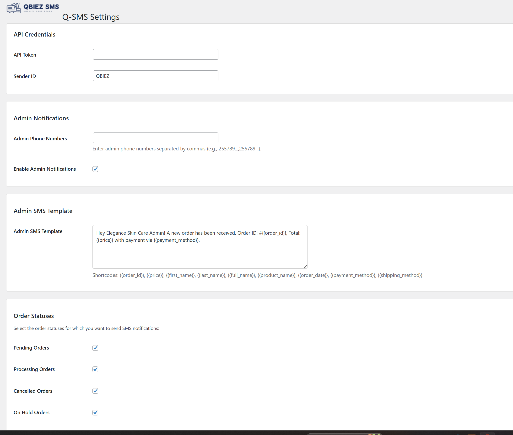
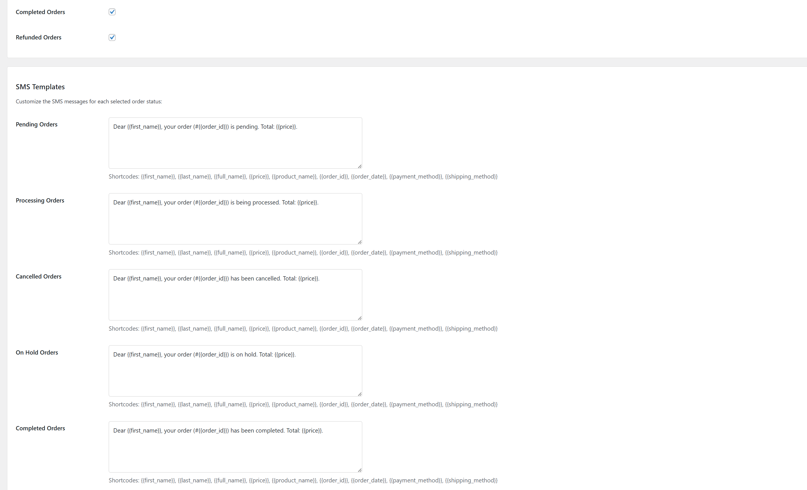

# Q-SMS WooCommerce Integration

Official Q-SMS gateway integration for WooCommerce that enables automated SMS notifications for order updates and customer communications.

## Features ✨

- **Order Status Notifications**: Automatic SMS for all WooCommerce order statuses (pending, processing, completed, etc.)
- **First Order Alert**: Special SMS for customers placing their first order
- **Admin Notifications**: Instant SMS alerts to store administrators
- **Customizable Templates**: Fully editable SMS templates with dynamic variables
- **Tanzania-Optimized**: Automatic phone number formatting for Tanzanian numbers
- **API Integration**: Secure connection with Q-SMS gateway

## Installation 🛠️

1. Download the [latest release](https://github.com/ino3103/qbiez-sms-woocommerce-plugin/archive/main.zip)
2. Upload to your WordPress plugins directory (`/wp-content/plugins/`)
3. Activate the plugin through WordPress admin
4. Configure your settings under: **WordPress Dashboard → Settings → Q-SMS Settings**

## Configuration ⚙️

After activation:
1. Obtain your API credentials from [Q-SMS Dashboard](https://sms.qbiez.com)
2. Enter your:
   - API Token
   - Sender ID
   - Admin phone numbers (comma separated)
3. Customize SMS templates for each order status
4. Enable/disable notifications per status

## Template Variables 📝

Use these placeholders in your SMS templates:
- `{{first_name}}` - Customer's first name
- `{{last_name}}` - Customer's last name  
- `{{full_name}}` - Customer's full name
- `{{price}}` - Order total amount
- `{{order_id}}` - WooCommerce order ID
- `{{order_date}}` - Date of order
- `{{product_name}}` - Name of purchased products
- `{{payment_method}}` - Payment method used
- `{{shipping_method}}` - Shipping method selected

## Screenshots 📸

  
*Q-SMS Plugin Settings Page*

  
*Example SMS Received by Customer*

## Support 💬

For support:
- Open a [GitHub Issue](https://github.com/ino3103/qbiez-sms-woocommerce-plugin/issues)
- Email: [support@qbiez.com](mailto:support@qbiez.com)
- Visit: [QBIEZ Support](https://sms.qbiez.com/support)

## Changelog 📌

**1.0.0** (2023-11-15)
- Initial release with core SMS functionality
- Support for all WooCommerce order statuses
- Admin notification system

## License 📄

This plugin is licensed under [GPLv2](https://www.gnu.org/licenses/gpl-2.0.html) or later.

---

Developed by [QBIEZ](https://sms.qbiez.com) | [Contribute](https://github.com/ino3103/qbiez-sms-woocommerce-plugin)